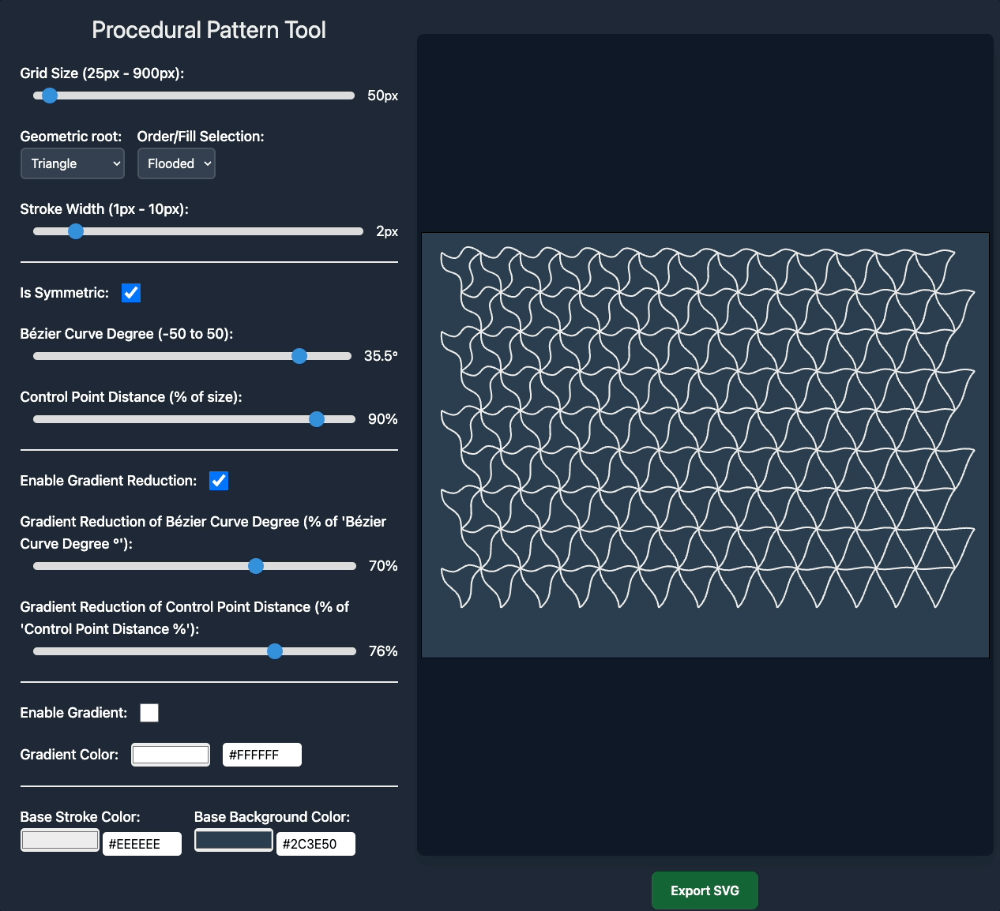
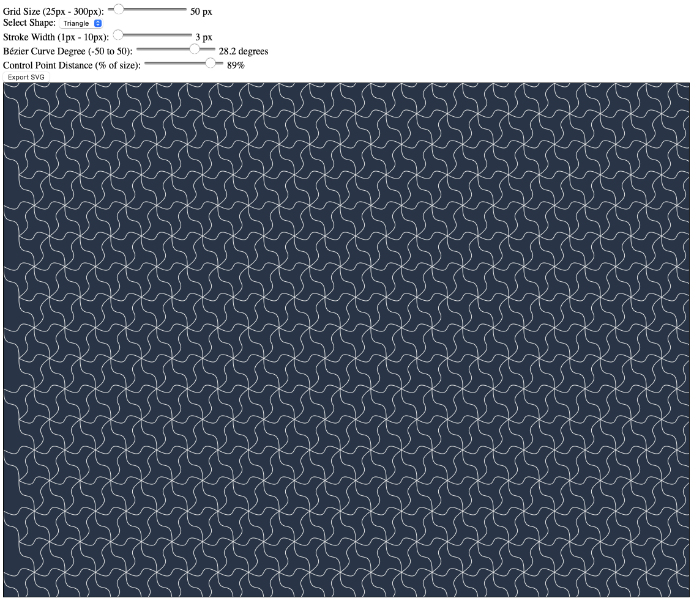

# Fractal Plane

**Fractal Plane** is a browser-based tool for generating beautiful geometric patterns using Bézier curves. It creates mesmerizing, symmetrical designs that can be customized through an intuitive interface and exported as SVG files.

## Features

- **Interactive Pattern Controls**:
  - Switch between square and triangle patterns
  - Adjust grid size from 25px to 300px
  - Fine-tune stroke width from 1px to 10px
  - Control Bézier curve angles (-50° to 50°)
  - Adjust control point distance (0-100% of shape size)

- **Real-time Preview**: All adjustments render instantly in the preview canvas
- **Dark Mode**: Triangle patterns display on a dark blue (#2C3E50) background
- **SVG Export**: Save your designs as scalable vector graphics

## Preview

The tool generates intricate patterns like the one above, where each shape's edges can be curved using Bézier mathematics for smooth, organic-looking results.

#### In action

#### Ready for export

## Implementation Details

Built using:
- D3.js for SVG manipulation and rendering
- Pure TypeScript for logic and controls
- HTML5 range inputs for interactive adjustments

## Getting Started

1. Clone the repository
2. Run `npm install`
3. Run `npm run dev`
4. Open the browser and navigate to `http://localhost:5173`
5. Start creating patterns by adjusting the controls

## Usage

1. Select your base shape (triangle or square)
2. Adjust the grid size to change pattern density
3. Modify the Bézier curve degree to add curvature
4. Fine-tune the control point distance for different curve styles
5. Adjust stroke width as needed
6. Export your design as an SVG file

## License

This project is open source and available under the MIT license.
